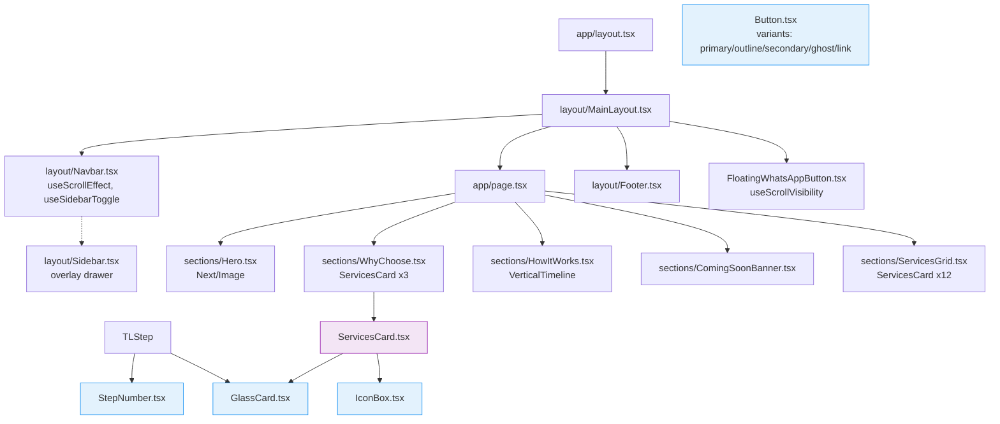

# FullCircle Static HTML to React/Next.js Migration Plan

## Confirmed Preferences
- **Next.js Router**: App Router (modern, server components, layouts)
- **TypeScript**: Full type safety for all components/props/state
- **Styling**: Tailwind CSS (responsive utilities, theme config for teal/glass) + CSS modules/global CSS for complex glassmorphism (backdrop-filter, custom animations)
- **Structure**: Follow specialist order - Component Library → Layouts → Pages
- **Hosting**: Update firebase.json for Next.js static export (matches current Firebase setup)

## Project Structure
```
FullCircle/
├── public/ (static assets: images, fonts - migrate to public/)
├── src/
│   ├── app/
│   │   ├── globals.css (Tailwind + custom glass vars)
│   │   ├── layout.tsx (Root layout)
│   │   └── page.tsx (Landing page)
│   ├── components/
│   │   ├── (Atomic - Button.tsx, GlassCard.tsx, IconBox.tsx, StepNumber.tsx)
│   │   ├── sections/ (Composite - Hero.tsx, ServicesSection.tsx, VerticalTimeline.tsx)
│   │   └── layout/ (MainLayout.tsx, Navbar.tsx, Sidebar.tsx, Footer.tsx)
│   ├── lib/
│   │   ├── utils.ts (cn, scroll hooks)
│   │   └── constants.ts (teal colors, services data)
│   └── assets/ (SVGs like whatsapp-icon.svg)
├── tailwind.config.ts
├── next.config.js (Image optimization)
├── firebase.json (Updated for Next.js)
├── package.json (Next.js 14+, TypeScript, Tailwind, lucide-react)
└── README.md (Component docs)
```

## Component Hierarchy & Dependencies



## Data Flow & State
- **Global**: No complex state (static landing) - use React Context if needed for theme
- **Local**:
  - Sidebar: `useState(open)` + `useEffect(scroll)`
  - Navbar: `useState(scrolled)`
  - Floating WA: `useState(visible)` based on scroll + hero visibility
- **Props**: Fully typed interfaces (e.g., `interface ServicesCardProps { title: string; desc: string; icon: LucideIcon }`)

## Styling Migration
```
CSS Variables → Tailwind config:
--teal-900: '#003d38' → theme.extend.colors.teal
--glass-bg: 'rgba(255,255,255,0.45)' → custom utilities [@apply backdrop-blur-md bg-glass/45 border-glass/60]
Liquid glass: CSS modules for ::before pseudo-elements, animations
Responsive: Tailwind classes matching existing @media breakpoints
```

## Todo List Progress
| # | Task | Status |
|---|------|--------|
| 1 | Assess existing code | [x] Completed |
| 2 | Identify UI patterns | [x] Completed |
| 3 | Detailed architecture w/ Mermaid | [-] In Progress (this file) |
| 4 | Next.js setup (App Router + TS + Tailwind) | [ ] Pending |
| ... (full list continues) |

## Button Component Architecture

We will start with the `Button` component as the foundational element.

### File Structure
```
components/
├── Button.tsx        # Main component with variants
```

### Props Interface
```typescript
interface ButtonProps extends React.ButtonHTMLAttributes<HTMLButtonElement> {
  variant?: 'primary' | 'secondary' | 'outline' | 'ghost' | 'link';
  size?: 'sm' | 'md' | 'lg' | 'icon';
  isLoading?: boolean;
  leftIcon?: React.ReactNode;
  rightIcon?: React.ReactNode;
}
```

### Accessibility (a11y)
- Use native `<button>` element.
- `aria-disabled` when `isLoading` or `disabled`.
- Keyboard focus rings (visible in Tailwind `ring-` utilities).

## Implementation Phases (Specialist Order)
1. **Component Library** (todos 4-6): Atomic → Composite
2. **Layouts** (todos 7-13): Navbar/Sidebar/Footer/MainLayout
3. **Pages** (todos 14+): Assemble index, test, optimize

## Risks & Mitigations
- **Glassmorphism perf**: Use `will-change: transform` + hardware acceleration
- **Scroll effects**: Throttle with `useCallback` + `requestAnimationFrame`
- **Icons**: Migrate LineIcons to lucide-react (similar API)
- **Firebase**: Static export: `next build && next export`
- **SEO**: Metadata in app/layout.tsx

### Technical Debt: Bootstrap vs Tailwind Conflict
> [!WARNING]
> **Issue**: The project currently loads `bootstrap.min.css` which has high-specificity selectors that conflict with Tailwind's utility classes (especially for buttons, inputs, and base resets).
> 
> **Current Workaround**:
> 1. **CSS Import Order**: Bootstrap is imported *before* Tailwind in `globals.css` to allow properly cascaded overrides.
> 2. **Important Modifiers**: In `components/Button.tsx`, we use Tailwind's `!` modifier (e.g., `!bg-primary`) to force our styles over Bootstrap's.
> 
> **Future Mitigation (High Priority)**:
> - **Goal**: Completely remove `bootstrap.min.css`.
> - **Strategy**:
>   - Audit `public/assets/css/bootstrap.min.css` usage.
>   - Replace Bootstrap Grid (`row`, `col-lg`) with Tailwind Grid/Flex.
>   - Replace Bootstrap Components (Navbars, Carousels) with custom Tailwind components.
>   - Once all legacy HTML is refactored to React components, uninstall/delete Bootstrap.

Ready for code mode execution.